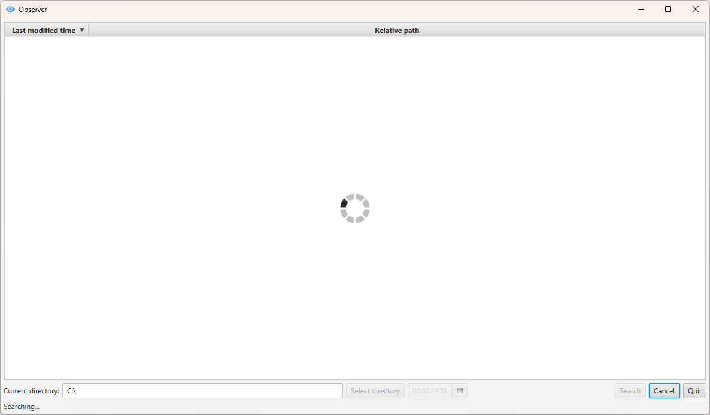

# Observer
JavaFX application for searching files in a specific directory since certain date



## Main features
* Multithreading
* User-friendly interface using JavaFX
* Sorting by date by default

## Requirements
- JDK 22
- Maven 3.9+

## How to run

### Option 1: Run via Maven (Recommended for developers)
```bash
mvn javafx:run
```
### Option 2: Build and run Fat JAR
#### If you wish to build the project into single JAR:
1. Build project

```bash
mvn clean package
```
2. Run JAR from target directory
```bash
java -jar target/observer-1.0.0-beta.jar
```
### Option 3: Download ready-to-use binary (Recommended)
#### You don't have to build the project manually. Just download the ready-made binary file:
1. Go to **[Releases](https://github.com/paulv-dev/observer/releases)** section
2. Download observer-1.0.0-beta.jar
3. Run it with
```bash
java -jar observer-1.0.0-beta.jar
```

## Roadmap
Here are some features intended to be included in further releases:

- [ ] File filtering
  - by name (regex patterns)
  - by extension
  - by attributes(hidden, read-only, ...)
  - by date and time range
- [ ] Search result processing
  - Copying a file to the clipboard
  - Open/run selected file
  - Saving file list as a report
- [ ] UX/UI extension
  - Favorites (paths)
  - Multiple language support (i18n)
- [ ] Performance
  - Large directories search optimization

---
Copyright © 2026 [Paul Vishnevsky]. Licensed under the [MIT License](LICENSE).